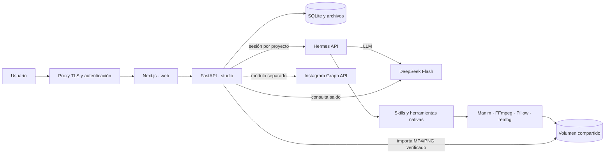

# Arquitectura de QUARK

`web` publica únicamente `127.0.0.1:8010`; `studio` y `hermes` quedan en la red Docker. El proxy TLS del servidor debe autenticar al operador. `PUBLIC_APP_ORIGIN` autoriza el origen HTTPS en el backend.

Un pedido se guarda como ejecución en `runs`. FastAPI lo envía a Hermes con `X-Hermes-Session-Id` estable por proyecto, los pedidos anteriores del usuario y la guía de producción de QUARK. Hermes lee recursos de `/workspace/assets` y conserva fuentes editables en `/workspace/hermes/<id>`. Solo `final.mp4` o `final.png` puede convertirse en un adjunto. FastAPI verifica el formato, la duración solicitada y la presencia de audio cuando se pidió locución; nunca rescata una escena parcial como si fuera el video completo. Crea una copia inmutable para la galería. Las siguientes instrucciones reutilizan la sesión y las fuentes para cambiar la misma pieza. Las herramientas de generación por difusión están deshabilitadas; las fotos vienen del usuario.

La identidad pública y el alcance están definidos en `hermes/SYSTEM.md`. Antes de llegar a Hermes, el backend responde directamente preguntas de identidad y pedidos evidentes de programación. Los pedidos claros de contenido de marca pasan al agente sin repetir el brief; los demás se clasifican como marketing, ajenos o ambiguos con una llamada corta de DeepSeek sin herramientas. Si la clasificación falla o es ambigua, pide aclaración y no ejecuta herramientas. Después de Hermes, el backend quita datos base64, rutas y detalles internos. El texto y los adjuntos validados se guardan por separado en `messages`, y el frontend solo renderiza referencias a exportaciones verificadas. Los costos de la clasificación quedan en `aux_usage`.

DeepSeek Flash es el único modelo configurado. La clave se inyecta por `.env` al contenedor de Hermes; QUARK nunca la envía al navegador. La API `/api/deepseek/balance` consulta el saldo actual. La imagen Docker fijada de Hermes incorpora un pequeño parche en `hermes/patch_usage.py` para añadir a la respuesta de chat los aciertos de caché que el agente ya registra. La API `/api/costs` usa esos tokens, la tarifa pico/valle y la caché para estimar el costo por ejecución y por pieza. Las llamadas auxiliares de Hermes quedan fuera del agregado; un pedido sin datos de tokens queda sin precio. El saldo oficial decide cuánto crédito resta.

Instagram conserva webhooks, reglas FAQ, revisión y publicación como módulo independiente. Todavía no usa DeepSeek para sugerir respuestas. El presupuesto de US$2 se emplea solo en el agente creativo durante esta prueba.
