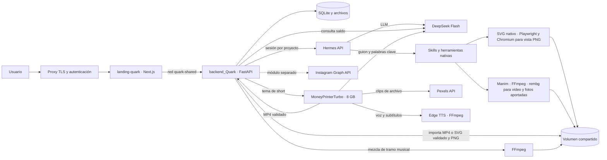

# Arquitectura de QUARK

`landing-quark` publica `127.0.0.1:8010` desde su propio Compose. `backend_Quark` publica la API en `127.0.0.1:8011` para comprobaciones locales y conecta `studio` a la red `quark-shared`; Hermes permanece en la red privada del backend. El proxy TLS del servidor debe autenticar al operador. `PUBLIC_APP_ORIGIN` autoriza el origen HTTPS en el backend.

Un pedido se guarda como ejecución en `runs`. FastAPI lo envía a Hermes con `X-Hermes-Session-Id` estable por proyecto, los pedidos anteriores del usuario y la guía de producción de QUARK. Hermes lee recursos de `/workspace/assets` y conserva fuentes editables en `/workspace/hermes/<id>`. Para imágenes estáticas, `quark-static-post` crea SVG nativo guiado por las skills editorial, producto o tipográfica; el finalizador incrusta fotos aportadas y rechaza SVG inseguro. Playwright genera una vista PNG y comprueba dimensiones y elementos fuera del lienzo. El SVG se entrega en el chat; el PNG queda como vista y formato para Instagram. Para video se mantiene Manim. FastAPI verifica los archivos, la duración solicitada y la presencia de audio cuando se pidió locución. Si Hermes agota sus pasos antes de exportar, FastAPI puede unir solamente todas las escenas nuevas definidas en el script, en ese orden, con formato y duración compatibles; nunca entrega una escena parcial como video completo. Crea una copia inmutable para la galería. Las siguientes instrucciones reutilizan la sesión y las fuentes para cambiar la misma pieza. Las herramientas de generación por difusión están deshabilitadas; las fotos vienen del usuario.

La identidad pública y el alcance están definidos en `hermes/SYSTEM.md`. Antes de llegar a Hermes, el backend responde directamente preguntas de identidad y pedidos evidentes de programación. Los pedidos claros de contenido de marca pasan al agente sin repetir el brief; los demás se clasifican como marketing, ajenos o ambiguos con una llamada corta de DeepSeek sin herramientas. Si la clasificación falla o es ambigua, pide aclaración y no ejecuta herramientas. Después de Hermes, el backend quita datos base64, rutas y detalles internos. El texto y los adjuntos validados se guardan por separado en `messages`, y el frontend solo renderiza referencias a exportaciones verificadas. Los costos de la clasificación quedan en `aux_usage`.

Hermes usa DeepSeek Flash y MoneyPrinterTurbo usa DeepSeek V4 Flash con la misma clave del `.env`; QUARK nunca la envía al navegador. La API `/api/deepseek/balance` consulta el saldo actual. La imagen Docker fijada de Hermes incorpora un pequeño parche en `hermes/patch_usage.py` para añadir a la respuesta de chat los aciertos de caché que el agente ya registra. La API `/api/costs` usa esos tokens, la tarifa pico/valle y la caché para estimar el costo por ejecución y por pieza. Para shorts, se observa el cambio aproximado del saldo al finalizar. Las llamadas auxiliares de Hermes quedan fuera del agregado; un pedido sin datos de tokens ni diferencia de saldo queda sin precio. El saldo oficial decide cuánto crédito resta.

Instagram conserva webhooks, reglas FAQ, revisión y publicación como módulo independiente. Todavía no usa DeepSeek para sugerir respuestas. El presupuesto de US$2 se emplea solo en el agente creativo durante esta prueba.

El selector **Short automático** envía el tema directamente a MoneyPrinterTurbo. Ese servicio usa la misma clave DeepSeek, una clave gratuita de Pexels configurada en el servidor, Edge TTS y FFmpeg. El backend espera el trabajo, acepta solo una ruta de salida bajo `/tasks/`, descarga y verifica duración y audio antes de mostrar un único MP4 en el chat. El servicio no publica puertos al host y su imagen está fijada a la versión 1.3.7. Los pedidos normales de video siguen pasando por Hermes para conservar la edición iterativa.

La música se adjunta al proyecto como recurso de audio. El usuario elige un tramo de la canción, escucha la vista previa en el navegador y decide el segundo del video y volumen de entrada. El backend valida el archivo y la duración con FFprobe, y FFmpeg mezcla esa selección en el MP4 sin alterar la pista visual ni eliminar la locución. La selección persiste por conversación y se aplica tanto a videos de Hermes como a shorts. El delta del saldo DeepSeek permite estimar el costo de un short cuando el cobro ya se reflejó; no equivale a medición por tokens y puede solaparse con otras solicitudes simultáneas.
